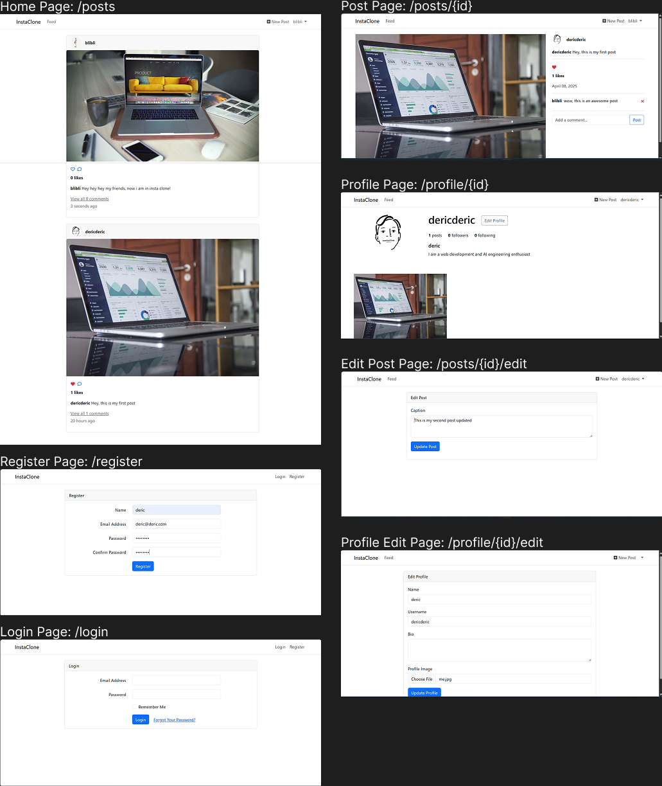

# Instagram Clone

## Overview

**Instagram Clone** is a simplified Instagram-like app that allows users to log in, register, and interact with posts through CRUD operations, likes, and comments.

## Features

### ✅ Current Features:
- User authentication (login/register)
- Create, read, update, and delete (CRUD) posts
- Like/unlike posts
- Add and view comments on posts

## Installation

To get started with the **Instagram Clone**, follow these steps:

1. **Clone the repository:**

    ```bash
    git clone https://github.com/muhammadderic/lrv_mini_instagram_clone.git
    cd lrv_mini_instagram_clone
    ```

2. **Install dependencies:**

    ```bash
    composer install
    npm install
    ```

3. **Configure environment:**
   - Copy `.env.example` to `.env` and set up your MongoDB connection.

4. **Run the application:**

    ```bash
    php artisan serve
    npm run dev
    ```

    Visit [http://localhost:8000](http://localhost:8000) to use the app.

## Screenshots

<div style="display: flex; justify-content: space-between;">
    
</div>

## Technologies Used

- **Laravel 12** – PHP framework for backend logic and routing
- **MongoDB** – NoSQL database for storing posts, likes, and comments

## Contributing

Contributions are welcome! If you'd like to contribute to this project, please follow these steps:

1. Fork the repository.
2. Create a new branch for your feature or bugfix.
3. Commit your changes and push your branch.
4. Open a pull request to have your changes reviewed.

## License

This project is licensed under the MIT License. See the [LICENSE](LICENSE) file for more details.

## Contact

If you have any questions or suggestions, feel free to reach out:

- **GitHub**: [muhammadderic](https://github.com/muhammadderic)